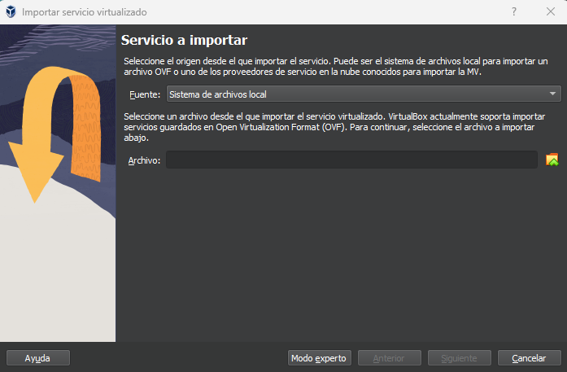
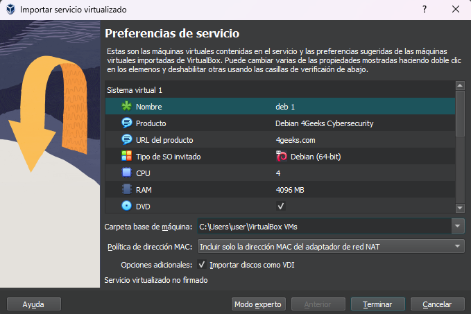

# `01` Importando una maquina virtual

## 01 Descarga el archivo OVA

 > [Descarga aquí](https://storage.googleapis.com/breathecode/virtualbox/deb.ova).

## 02 Abre el archivo OVA

El archivo OVA contiene el disco duro virtual con el sistema operativo ya listo para funcionar y un conjunto de configuraciones recomendadas para la ejecución de la máquina. Al hacer doble click en él te aparecerá en VirtualBox el asistente para confirmar la importación de la máquina.

Si por alguna razón no se ejecuta VirtualBox al abrir el archivo OVA, puedes importarlo manualmente desde el menu `Archivo>Importar servicio virtualizado...` en la ventana de VirtualBox. Ahi verás un cuadro de dialogo donde podrás indicarle a VirtualBox cual es el archivo OVA que quieres importar

### Importar archivo OVA

### Confirmación de la configuración

## 03 Ejecuta tu nueva máquina virtual

Una vez termine el proceso de importación, estas listo para arrancar tu nueva máquina Debian. La máquina ya viene configurada con claves de acceso, pero como buen estudiante de ciberseguridad, sabes que deberías cambiarlas por alguna más segura.

> **Información de acceso** 
**Usuario**: deb 
**Clave**: 123456 
**ClaveRoot**: 123456
