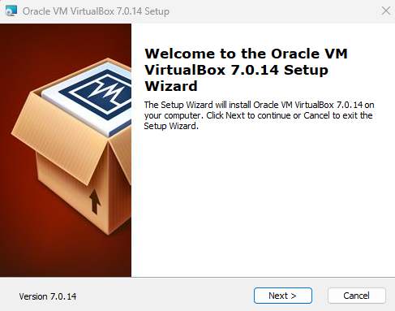

# `01` Instalación de VirtualBox

En ésta práctica aprenderás a crear una maquina virtual con VirtualBox, y luego a instalar un sistema operativo en ella. Estas maquinas serán tu laboratorio a lo largo del curso, en ellas podrás explorar de manera segura sin afectar el propio sistema operativo de tu máquina. Lo peor que puede pasar es que tengas que instalar la maquina virtual de nuevo, pero tu computadora siempre estará a salvo.

## Instalación en Windows

Visita la web oficial de [VirtualBox](https://www.virtualbox.org/wiki/Downloads) para obtener el instalador para windows. La instalación es tan fácil como cualquier otra aplicación de windows. Al ejecutar el instalador te aparecerá un asistente que te guiará durante el proceso.

### 1. Inicia el instalador



### 2. Instala todas las características


### 3. Avanza con el botón "Yes" o "Next" hasta finalizar


## Instalación en GNU/Linux

En el caso de sistemas GNU/Linux hemos preparado 2 scripts que te van a ayudar con la instalación
https://www.virtualbox.org/wiki/Linux_Downloads#Debian-basedLinuxdistributions

### Distribuciones basadas en Debian (deb)

Para instalar VirtualBox solo tienes que ejecutar el siguiente comando

```bash
wget https://raw.githubusercontent.com/4GeeksAcademy/cybersecurity-scripts/main/installing-virtualbox-linux-debian/install-virtualbox.sh -O - | sudo sh
```

### Distribuciones basadas en RedHat (rpm)

Primero necesitas instalar la llave para rpm con el siguiente comando.

```bash
wget -q https://www.virtualbox.org/download/oracle_vbox_2016.asc -O- | rpm --import -
```

A continuacion debes instalar los repositorios de acuerdo a tu distribución.

- Usuarios de [Oracle Linux / RHEL](https://download.virtualbox.org/virtualbox/rpm/el/virtualbox.repo) deben agregar el repositorio a la carpeta /etc/yum.repos.d/.
- Usuarios de [Fedora](https://download.virtualbox.org/virtualbox/rpm/fedora/virtualbox.repo) deben agregar el repositorio a la carpeta /etc/yum.repos.d/.
- Usuarios de openSUSE deben agregar el [archivo de repositorio](https://download.virtualbox.org/virtualbox/rpm/opensuse/virtualbox.repo) a /etc/zypp/repos.d/.

## Instalación en macOS con procesadores Intel

[Descarga aquí](https://download.virtualbox.org/virtualbox/7.0.14/VirtualBox-7.0.14-161095-OSX.dmg) el instalador para tu sistema operativo.

## Todas las opciones de instalación

Visita la web oficial de las descargas de VirtualBox
https://www.virtualbox.org/wiki/Downloads