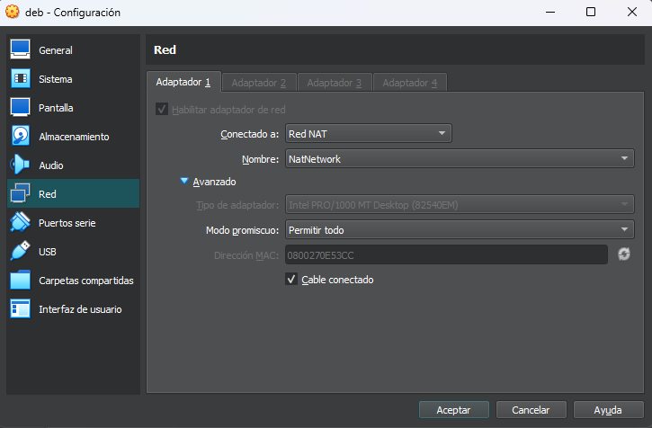

# `03` Interface configuration

Next you must add the interfaces to the virtual machines and assign them the NAT network you just created in the previous step.

In the configuration window of each machine, you will see on the left the ``Network`` option. There you will find the interfaces (also called `Adapters`) that you can have on your machine and the configuration tab that corresponds to each one.

In the `Connected to:` option you must choose `NAT Network` and then specify which network this machine will be part of.

The configuration should be as follows:

> Remember to do the same for both machines
