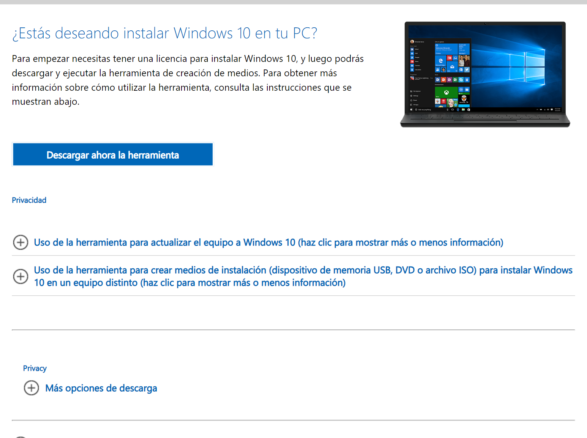
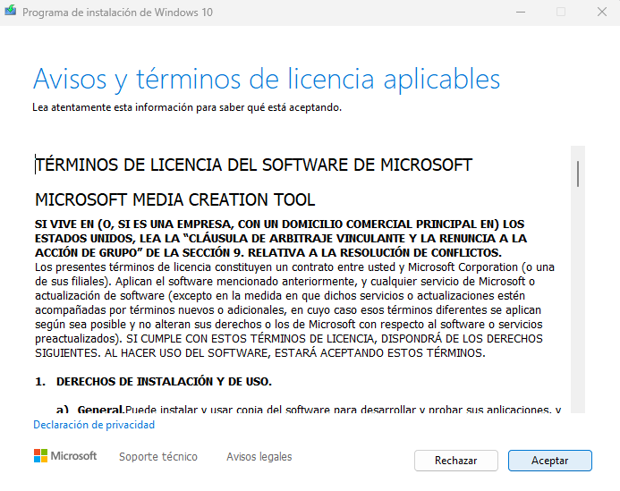
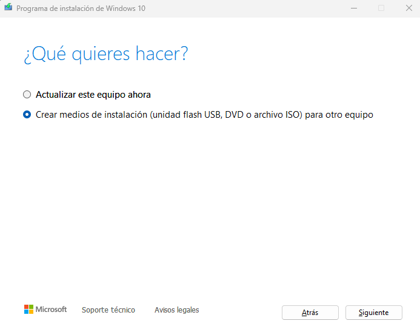
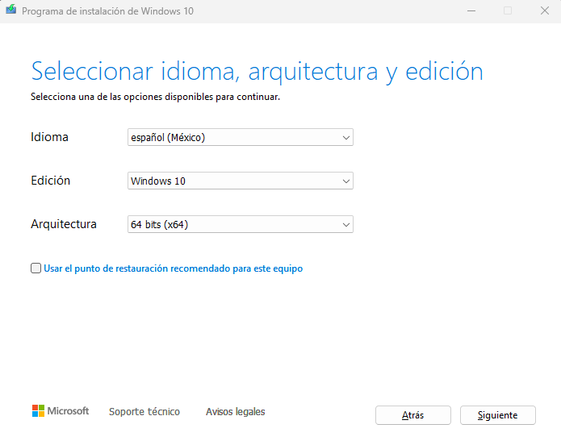
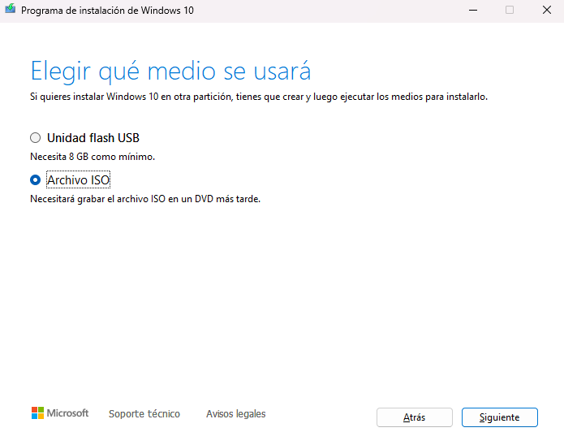
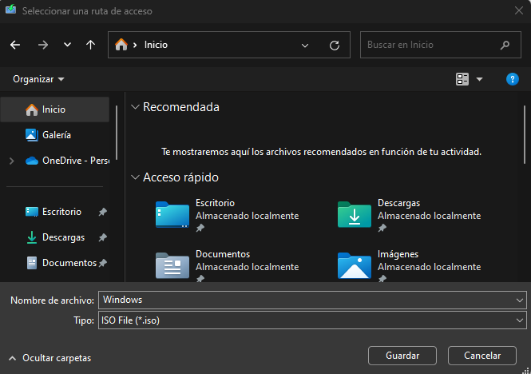

# Descarga un ISO de Windows 10

## Instalación en Windows

### 1. Descarga la herramienta de creación de medios

Visita la web oficial para [Descargar Windows 10](https://www.microsoft.com/es-es/software-download/windows10) para obtener la herramienta de creación de medios. Al ejecutar el instalador te aparecerá un asistente que te guiará durante el proceso.

### 2. Acepta los términos

### 3. Elije "Crear medios de instalación"

### 3. Personaliza tu instalación

Por defecto se tomará la misma configuración de la maquina donde estés ejecutando el asistente, pero si deseas cambiar las opciones desmarca la casilla "Usar el punto de restauración recomendado para este equipo"

### 4. Crea un archivo ISO

Es lo que necesitarás para crear tu máquina virtual

### 5. Elije donde guardar tu archivo ISO

Tratándose de un archivo tan pesado, tendrás que esperar un tiempo hasta que la descarga termine. Una vez terminada tendrás el ISO para crear tu máquina virtual.
