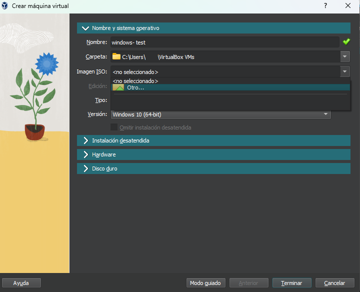
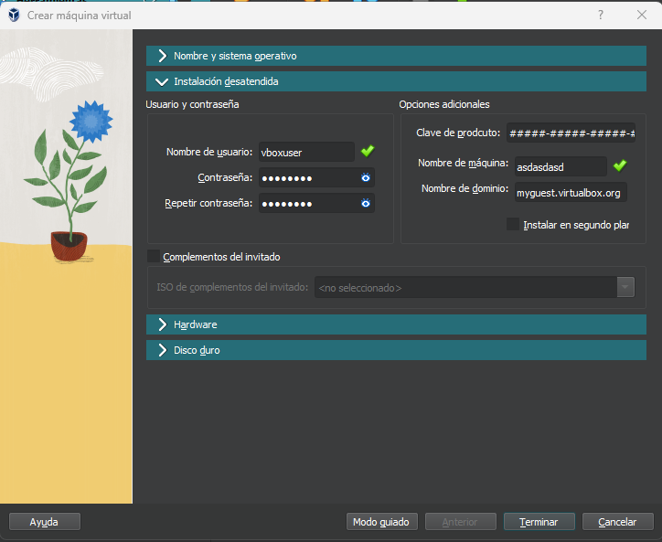
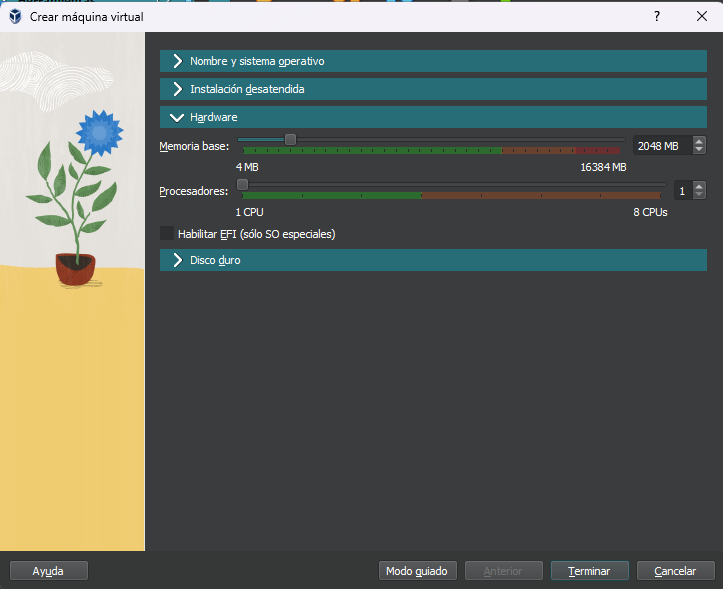
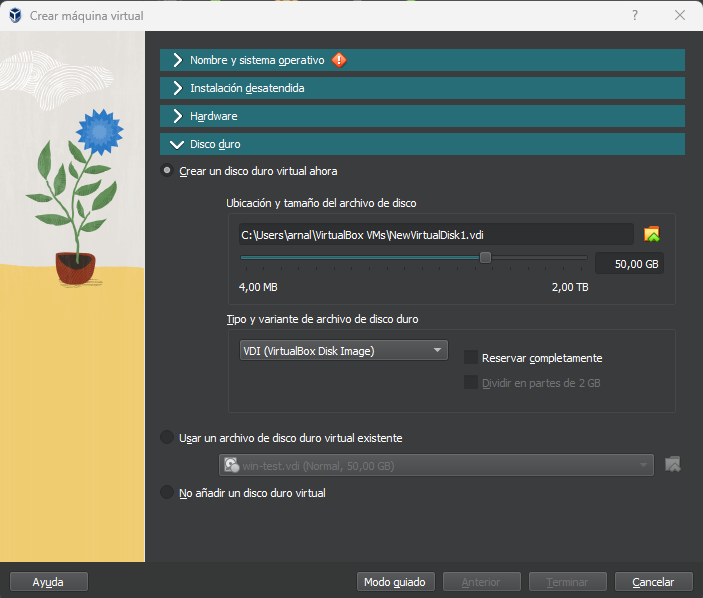

# Instalación de máquinas virtuales

En ésta práctica aprenderás a crear una maquina virtual con VirtualBox, y luego a instalar un sistema operativo en ella. Estas maquinas serán tu laboratorio a lo largo del curso, en ellas podrás explorar de manera segura sin afectar el propio sistema operativo de tu máquina. Lo peor que puede pasar es que tengas que instalar la maquina virtual de nuevo, pero tu computadora estará a salvo.

## Instalación en Windows

Visita la web oficial de [VirtualBox](https://www.virtualbox.org/wiki/Downloads) para obtener el instalador para windows. La instalación es tan fácil como cualquier otra aplicación de windows. Al ejecutar el instalador te aparecerá un asistente que te guiará durante el proceso.

### 1. Crea una nueva máquina Virtual

Al abrir VirtualBox podrás ver el icono de "Añadir" marcado con una cruz verde

### 2. Escribe un nombre para tu máquina y un sistema operativo

En la lista "Imagen ISO" deberás seleccionar la opcion "Otro" y agregar el archivo que creaste en el paso anterior

### 3. Instalación desatendida

En este paso puedes personalizar configuraciones de la maquina que estas creando y que se aplicarán automáticamente durante la instalación, para que esta no se vea interrumpida en su proceso. Al finalizar el proceso deberás elegir un par de opciones de privacidad, pero ya el trabajo pesado estará hecho.

### 3. Configuración de hardware

Aquí es donde eliges de cuanta memoria y procesador va a disponer tu maquina. Es importante asignar lo necesario para un funcionamiento optimo, sin comprometer el propio desempeño de la maquina anfitrión.

> Debes asignar como mínimo 2 cpus y 2 GB de memoria a la máquina

### 3. Configuración de almacenamiento

 
 Cuando presiones el botón "Terminar" se abrirá una ventana donde verás tu maquina virtual. Inmediatamente empieza el proceso de instalación, y gracias a la instalación desatendida solo tendrás que esperar hasta que el proceso termine y tendrás tu nueva maquina virtual con Windows 10.
