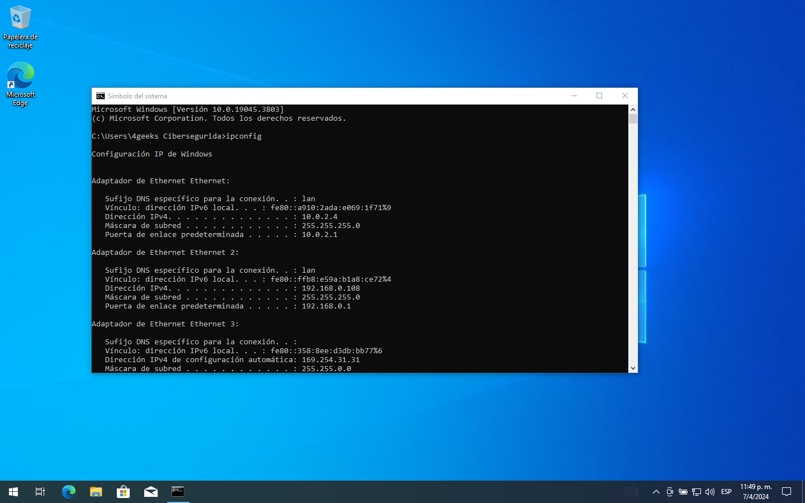
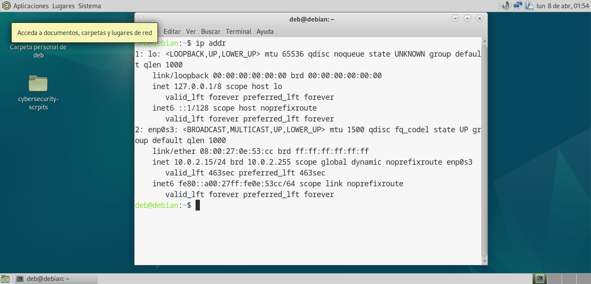
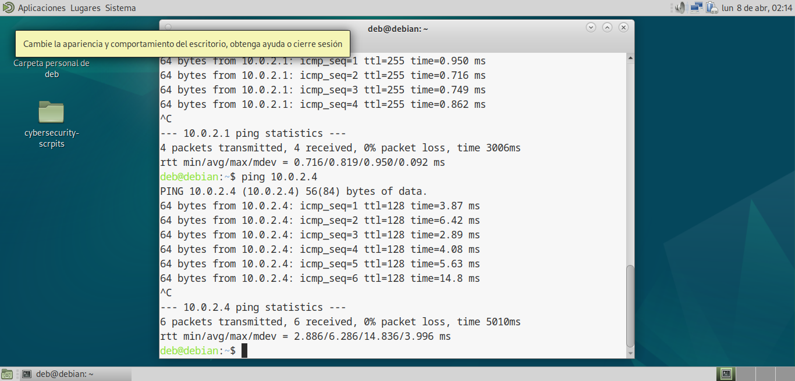
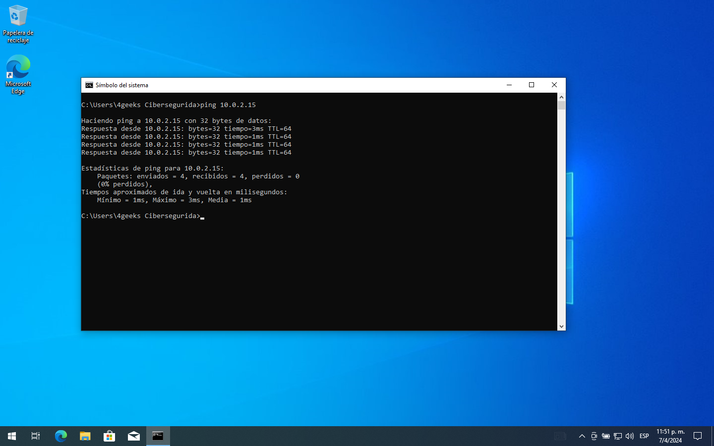

# `03` Probando la conexión

Una vez dentro de cada máquina virtual, podemos ver que se muestran las interfaces como conexiones normales en una computadora.

Si verificas las direcciones IP de cada una, puedes constatar que se encuentran en el mismo rango IP. Para ellos ejecuta los siguientes comandos en las terminales de cada sistema.

> **En Windows**: `ipconfig`

> **En Debian**: `ip addr`

Verificadas las direcciones puedes realizar una prueba `ping` para verificar la conectividad entre ambas máquinas. El comando es idéntico en Windows y Debian, solo debes seguirlo con la dirección IP de la maquina con la cual quieres probar conexión. 

Por ejemplo, a continuación puedes ver como 2 máquinas virtuales se pueden hacer `ping` mutuamente.

> `ping 10.0.2.4`

> `ping 10.0.2.15`

> Por defecto, hay algo en Windows que no le permite responder a la petición de ping que reciba la máquina. Averigua qué es y desactivalo para poder realizar la prueba.
