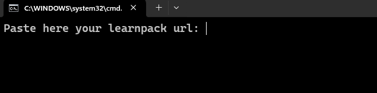

# `05` Validate your installation

## 1. CURL

It is a tool that allows you to make requests to a web page from the terminal of your system, it can also perform other functions, but this is the one that concerns us in this case.

For windows you must download the tool from [this link]((https://curl.se/windows/)) and then install it before proceeding to the next step.

You can skip this step if you already have curl installed

## 2. Enable public port

In order for learnpack to receive the information that will be send from your machine, is necessary to enable public access to the port, witch for safety reasons comes private by default.

For this select the "Ports" tab in the lower panel of codespace, there you'll see the ports that are beign used. You'll need to publish the port `3001` and for that right click on the port, go to the menu `Port visibility` and select the `Public` option.

## 3. Validation Script

It is a script that we have developed to the measure of this practice. It is in charge of taking the information from VirtualBox and send it to do the validation. First you must download the script and run it, it will ask you for a URL that you can find in the `url.txt` file found in this practice.

[Download the script for validation on Windows here.](https://github.com/4GeeksAcademy/networks-on-virtualbox/blob/master/.learn/assets/sendDataWin.zip)

[Download the script for validation on Linux here.](https://github.com/4GeeksAcademy/networks-on-virtualbox/blob/master/.learn/assets/sendDataBash.zip)

Remember extracting the file before executing it on the host machine.

## 3. Running the test

Once the script is successfully executed, you will be able to run the test to validate your Windows installation in VirtualBox.

## 4. Done!

If you passed the tests, you have already installed a virtual machine with windows. This will be your safe place to do experiments and tests during the course.

If you have any problems do not hesitate to contact a mentor or the other support channels offered by 4Geeks.
