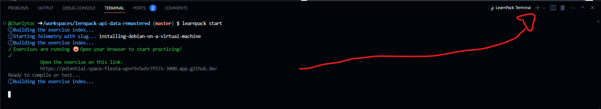
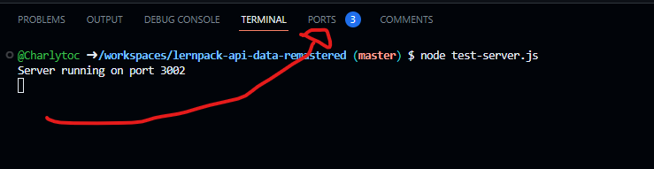
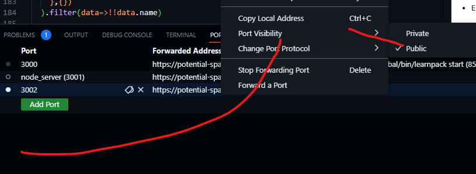

# `01` Receive data from your computer
Congratulations for reaching this exercise! Blablabla

Run a server in the codespace to be able to receive information from your local machine.

## Instructions

1. Open a new terminal in your codespace


2. Run the following command: NOTA PARA EL EDITOR: EN EL DEVCONTAINER.JSON YA CONFIGURE PARA QUE EL SERVIDOR server.js corra en background, es cuestión de que guardes el archivo en local y lo uses en el test, los primeros dos pasos podrías eliminarlos y solo hacer al estudiante cambiar la visibilidad del puerto, el paso 3, que corra el BAT en local y que corra los tests
```bash
node test-server.js 
```
3. Change the port visibility



3. Explain the user how to run the BAT file to receive the data in the server


## Video compatibility

If you want to include some video introduction for each exercise, add a `intro` property in the markdown frontmatter of the README.md for that particular exercise:

```markdown
---
intro: "https://www.youtube.com/watch?v=YkgkThdzX-8"
---
```

You can also add a video solution for each exercise by adding a `tutorial` property on the markdown frontmatter of it's README.md:

```markdown
---
intro: "https://www.youtube.com/watch?v=YkgkThdzX-8"
tutorial: "https://www.youtube.com/watch?v=YkgkThdzX-8"
---
```
